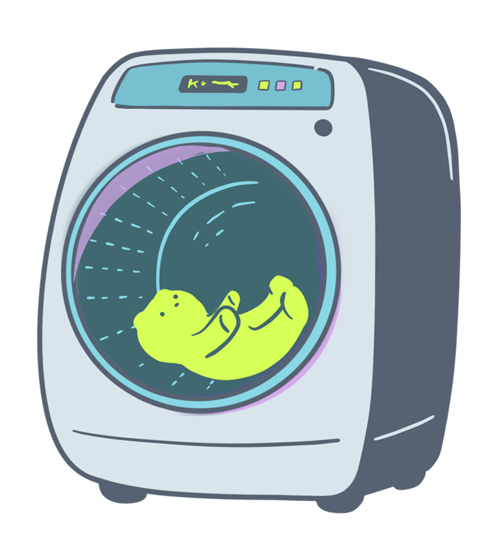

## Hi there 👋
<<<<<<< HEAD

砂川　愛海　　  
Sunagawa Aimi  
2005/07/09 Okinawa

### 検定・資格

- SEA/J 情報セキュリティ技術認定　基礎コース
- CompTIA IT Fundamentals(ITF+)
- インターネット検定 .com Master BASIC
- LinuC Level1 Exam 101(Version 10.0)
- サーティファイ　実践プログラミング技術者試験　 Python 部門　 Bronze
- サーティファイ　 Java プログラミング能力認定試験　 3 級
=======
砂川　愛海  
Sunagawa Aimi　　　　　  
2005/07/09 - Okinawa  

### 経歴  
 - 高校：浦添工業高校　卒
 - 専門：ITカレッジ沖縄　在学

### 検定・資格[^1]  
- SEA/J情報セキュリティ技術認定　基礎コース　  
- CompTIA IT Fundamentals(ITF+)  
- インターネット検定 .com Master BASIC
- LinuC Level1 Exam 101(Version 10.0)
- サーティファイ　実践プログラミング技術者試験　Python部門　Bronze  
- サーティファイ　Javaプログラミング能力認定試験　3級
  
これからも更新していきます。  
[^1]: 資格の認定証などの画像は[こちら](./images/qualification/)から閲覧してください

>>>>>>> ee646e8698601a5739f9d76657f56578f43a1c64

<!--
**itc-s24016/itc-s24016** is a ✨ _special_ ✨ repository because its `README.md` (this file) appears on your GitHub profile.

Here are some ideas to get you started:

- 🔭 I’m currently working on ...
- 🌱 I’m currently learning ...
- 👯 I’m looking to collaborate on ...
- 🤔 I’m looking for help with ...
- 💬 Ask me about ...
- 📫 How to reach me: ...
- 😄 Pronouns: ...
- ⚡ Fun fact: ...
-->
